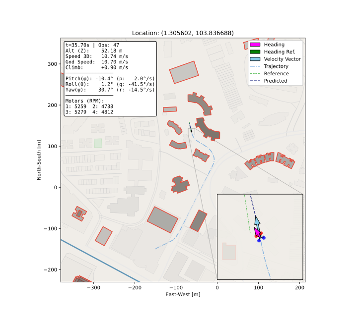

# 🧭 Larp: Last-Mile Autonomous Route Planning

> [!WARNING]
> **Alpha Stage:** This project is in active development. Expect breaking changes and bugs.

A fast, flexible Python toolkit for aerial autonomous urban navigation optimized for dynamic environments and complex spatial constraints.

<div align="center">
  
</div>

---

## Overview

**Larp** (/lärp/) is a modular framework for autonomous navigation that leverages *risk/potential fields* to model obstacles and UAM environmental constraints. It provides a full planning pipeline, from global path search to real-time trajectory optimization, where each stage can be used independently or replaced with a custom implementation. This makes Larp suitable for rapid prototyping, research work, and integration into UAM and UTM navigation systems.

---

## Composable Planning Pipeline

Larp structures navigation as a three-stage pipeline. Each stage is independently usable and interchangeable.

```
  RiskField / Environment
        |
        v
  [Global Planner]        larp.pp — Path planning over the field
        |
        v
  [Reference Planner]     larp.tp — Waypoint, Spline, or Quintic path follower
        |
        v
  [Trajectory Optimizer]  larp.tp — Traj. Opt. with dynamics and enviromental constraints
```

**Repulsive Risk Fields**
Model obstacles and spatial constraints using artificial repulsive fields that guide navigation using non-binary influence.

**Global Path Planning (`larp.pp`)**
Finds a collision-free global route from start to goal over a risk field. The `QuadPlanner` decomposes the field into a hierarchical quadtree network for fast multi-resolution search.

**Reference Trajectory Generation (`larp.tp`)**
Converts a global path into a time-parameterized reference for the optimizer. The `WaypointPlanner` uses arc-length projection for robust real-time tracking. `SplinePlanner` and `QuinticPlanner` provide C2 and C4 smooth profiles respectively.

**Trajectory Optimization (`larp.tp`)**
Solves a constrained optimal control problem at each time step, respecting vehicle dynamics, state and control bounds, and obstacle avoidance constraints derived from the risk field:

- `SQPSolver` — Sequential Quadratic Programming via OSQP; fast warm-started solves suitable for real-time operation.

The pipeline is composable. Any stage can be replaced — for example, substituting a custom global planner, using a different dynamics model, or feeding the optimizer references from an external source.

---

## Obstacle Representation

Obstacles are defined using **RGeoJSON** (Repulsion GeoJSON), an extension of the standard GeoJSON format that adds repulsion metadata to geometric features. Larp supports the full GeoJSON geometry set — `Point`, `LineString`, `Polygon`, `MultiPolygon`, and geometry collections — augmented with per-feature repulsion parameters such as replusion influence metric and per-obstacle features.

Because RGeoJSON is a superset of GeoJSON, standard GeoJSON files can be imported directly. Urban geometry from **OpenStreetMap** can be loaded via the `osmnx` integration, making it straightforward to plan over real city data without manual obstacle definition.

---

## Vehicle Digital Twin

The trajectory optimizer works with any dynamics model that implements the `larp.dynamics.Dynamics` interface, which defines state transition, Jacobian computation, and rollout methods. Several digital twin models are included out of the box, and new vehicles can be added by subclassing `Dynamics`. For high-fidelity simulation, `MJXDynamics` is actively being developed for JAX-compiled MuJoCo physics backend.

---

## Quick Start

```python
import numpy as np
import larp
import larp.io as lpio
from larp.env import WMR, FieldTrajectoryVisualizer

# Load a risk field from RGeoJSON (compatible with standard GeoJSON)
field = lpio.loadRGeoJSONFile("path/to/field.rgj")

# Build a quadtree for fast spatial queries
risk_caps = [0.1, 0.2, 0.4, 0.6, 0.8]
quadtree = larp.quad.QuadTree(field, maximum_length_limit=10, edge_bounds=risk_caps)

# Global path planning
planner = larp.pp.QuadPlanner(quadtree)
planner.select_alg("a*")
path = planner.find_path(start=(20, 20), end=(50, 55))

# Set up robot and trajectory optimizer
robot  = WMR(config={"wheels_distance": 1.0})
solver = larp.tp.ALILQRSolver(
    field           = field,
    dynamics        = robot.dynamics,
    dt              = 0.1,
    horizon         = 2.5,
    Q               = np.diag([10, 10, 5.0]),
    R               = np.diag([2, 2.0]),
    Qf              = np.diag([10, 10, 5.0]) * 3,
    u_bounds        = ([0.0, -2.0], [5.0, 2.0]),
    minimum_dist    = 2.0,
    linearize_every = 1,
    field_every     = 1,
    statefield_idxs = [0, 1],
)

# Reference planner tracks the global path
tj_planner = larp.tp.WaypointPlanner(
    solver            = solver,
    path              = path,
    stable_state      = [0, 0, 0],
    ref_state_indices = [0, 1, 2],
    goal_blend_dist   = 3,
)

# Run full trajectory
x0 = [20, 20, 0.0]
xs, us = tj_planner.get_full_trajectory(x0, nominal_speed=4, stride=1, max_steps=200)
```

---

## Project Structure

```
larp/
  field.py          RiskField and RGeoJSON geometry primitives
  quad.py           QuadTree and QRiskField spatial indexing
  dynamics.py       Dynamics base class and built-in vehicle models
  fn.py             Utility functions (routing, projection, interpolation)
  io.py             RGeoJSON / GeoJSON file I/O and coordinate projection
  pp/
    planner.py      FieldPlanner, QuadPlanner, QuadNetwork
  tp/
    solver.py       SQPSolver, ALILQRSolver, ALDDPSolver
    planner.py      WaypointPlanner, SplinePlanner, QuinticPlanner
  env/
    environments.py CityEnvironment, FieldHeatmapEnvironment
    visualizers.py  FieldTrajectoryVisualizer, CityVisualizer, ZoomedCityVisualizer
    twin.py         Digital twins
```

---

## Installation

```bash
pip install larp
```

### Requirements

- Python 3.8+
- `numpy >= 2.0.0`
- `scipy`
- `matplotlib` — environment visualization
- `osmnx` — OpenStreetMap urban data integration
- `jax` — automatic differentiation for digital twin dynamics

### Optional

- `osqp` — required for `SQPSolver`
- `mujoco-mjx` — required for complex digital twin models from files

---

## Examples

Interactive Jupyter Notebook demos:

- [General Demo](https://github.com/wzjoriv/Larp/blob/main/presentation.ipynb) — introduction to core functionalities
- [Hot Reloading for Global Planning](https://github.com/wzjoriv/Larp/blob/main/examples/Hot%20Reloading%20for%20Global%20Planning/presentation.ipynb) — dynamic updates of static obstacles for the global planner
- [Aerial Cargo Delivery Global Planning](https://github.com/wzjoriv/Larp/blob/main/examples/Cargo%20Delivery%20Global%20Planning.ipynb) — low-altitude global delivery planning across multiple global urban centers
- [Urban Air Mobility with Trajectory Optimization](https://github.com/wzjoriv/Larp/blob/main/examples/Urban%20Air%20Mobility%20of%20EVTOL/presentation.ipynb) — live trajectory optimization for eVTOL in urban airspace

---

## Citation

If you use Larp in your work, please cite:

```bibtex
@inproceedings{rivera2026citywide,
  title = {City-{{Wide Low-Altitude Urban Air Mobility}}: {{A Scalable Global Path Planning Approach}} via {{Risk-Aware Multi-Scale Cell Decomposition}}},
  booktitle = {Proceedings of the 2026 {{IEEE}} 6th {{International Conference}} on {{Human-Machine Systems}} ({{ICHMS}})},
  author = {Rivera, Josue N. and Sun, Dengfeng and Lv, Chen},
  year = 2026,
  month = jul,
  publisher = {IEEE},
  address = {Singapore},
  langid = {english}
}

@inproceedings{rivera2024air,
  title = {Air Traffic Management for Collaborative Routing of Unmanned Aerial Vehicles via Potential Fields},
  author = {Rivera, Josue N and Sun, Dengfeng},
  booktitle = {International Conference for Research in Air Transportation (ICRAT)},
  year = {2024},
  publisher = {ICRAT}
}
```

---

## License

Larp is released under the [GNU General Public License v3.0](https://www.gnu.org/licenses/gpl-3.0).

---

## Links

- [Homepage](https://github.com/wzjoriv/Larp)
<!-- - [Documentation](https://wzjoriv.github.io/larp/) -->
- [Issue Tracker](https://github.com/wzjoriv/Larp/issues)